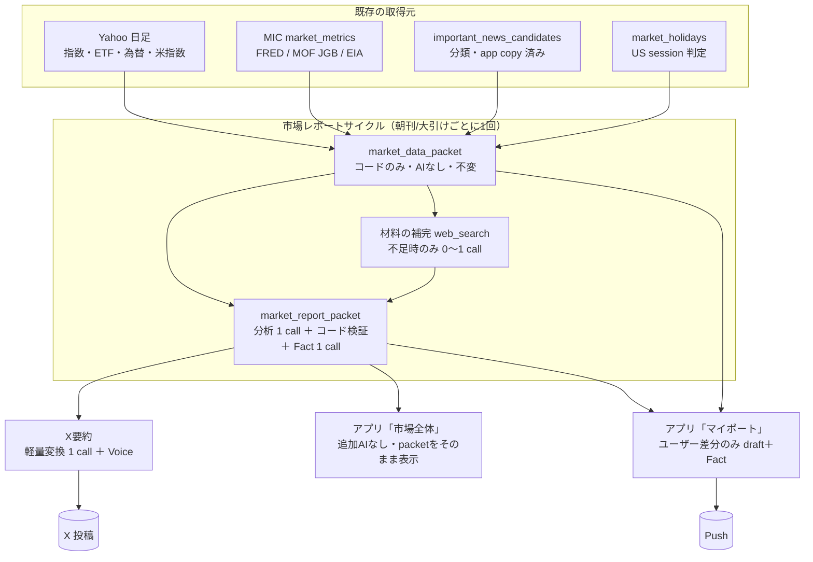

# 市場レポート共通基盤 — 監査と設計（朝刊・大引け × X・アプリ）

- task_id: `market-report-shared-platform-design-audit-20260916`
- 作成: 2026-09-17、Claude slot 1（G1）
- 種別: **設計・監査のみ**。アプリのコード、Edge Function、DB、Cron、設定、ユーザー設定は一切変更していない
- 根拠: `origin/main` `84648cd` のソース ＋ 本番DB・Cron・Functionの read-only 確認 ＋ Yahoo公開チャートAPIの read-only 取得
- 本番バージョン（2026-09-17 read-only）: `x-test-post` v109、`personalized-reports` v13、`important-news-monitor` v54、`market-intelligence-ingest` v11、`market-intelligence-state-evaluator` v7、`send-push-notifications` v15
  - 注意: `x-test-post` v109 の本番ソースと `origin/main` の一致は、この設計タスクでは byte 比較していない。以下のコード引用は `origin/main` 基準

関連する既存設計:

- [docs/market-intelligence/ARCHITECTURE.md](../market-intelligence/ARCHITECTURE.md) — Market Intelligence Core（MIC）Phase 0
- [docs/market-intelligence/PHASE_1B_STATE_LAYER.md](../market-intelligence/PHASE_1B_STATE_LAYER.md) — MIC State層
- [docs/news-coverage/REDESIGN.md](../news-coverage/REDESIGN.md) — 重要ニュース収集・分類

---

## 0. 結論（先に要点）

1. **4経路は、市場データ・ニュース・AI処理をほとんど共有していない。** X朝刊・X大引けはそれぞれ独自に web_search で材料を集め、アプリの朝刊・大引けは Yahoo 日足と重要ニュースだけを使う。同じ日の同じ市場について、4回別々の「事実」が作られている。
2. **X大引けは構造的に毎日失敗している。** 9/14・9/15・9/16 の3営業日連続で `CLOSE_REPORT_CLOSE_DATA_UNAVAILABLE`。原因は「1分足の最終バーが 15:30 以降であること」を要求する判定で、Yahoo の1分足のタイムスタンプは**足の開始時刻**のため、日経平均の最終足は 15:29、1306 は 15:24 になり、条件を満たせない（§1.5）。タスク記載の「90分以内判定で 17:00:01 に stale」は、現行コードでは既に 16:45〜17:05 の窓で救済済みで、主因ではない。
3. **アプリ大引けが成功するのは日足（`interval=1d`）と `regularMarketTime` を使っているから。** 同じ Yahoo、同じ銘柄でも取得方法の差だけで成否が分かれている。
4. **X朝刊の成功率も低い。** 直近4営業日で成功は9/15の1回のみ（9/14 形式不正、9/16 OpenAI 429×3、9/17 Voice JSON 解析失敗）。
5. **費用の一部が記録されていない。** X大引けは Fact 不合格時に検索・収集の費用（1回あたり約 $0.03）を `close_report_runs` に書かない（直近3日の失敗分は `api_cost_usd = null`）。成功時も Voice rewrite 呼び出しの費用は合算されていない。
6. **推奨設計:** 「1サイクル（朝刊/大引け）につき市場分析を1回だけ作り、X・アプリ市場全体・アプリマイポートがそれを参照する」。データはコード取得（AI不使用）を正本にし、AIは説明文と構造化分析だけを担当。保存は「サイクル行＋不変 packet テーブル」（§9 案B）。
7. **費用はユーザー1人では大きく下がらない**（1営業日 約 $0.09 → 約 $0.03〜0.09。幅は web_search を既定0回で済ませられる日の割合で決まる、§10）。効果は、(a) 市場分析の費用がユーザー数に比例しない、(b) X と アプリが同じ事実を語る、(c) アプリに「市場全体」タブが追加費用なしで付く、(d) X の失敗が減る、の4点。
8. **最初の実装は共通基盤ではなく、X大引けの終値取得の修正＋失敗時費用の記録**を推奨（§13）。基盤の shadow 化より先に、毎日落ちている本番経路を直す方が価値が大きく、リスクも小さい。

---

## 1. 現行4経路の監査

### 1.1 起動タイミング（本番 read-only）

| 経路 | 起動 | 時刻（JST） | 根拠 |
|---|---|---|---|
| X朝刊 | `dispatch-scheduled-posts`（毎分）→ `x-test-post` → `claim_due_post()` | 08:18〜08:22（中心 08:20） | `morning_report_settings` |
| X大引け | 同上 | 16:58〜17:02（中心 17:00） | `close_report_settings`（`futures_target_time=15:45`） |
| アプリ朝刊 | `personalized-reports-morning` `35 23 * * 0-4`（UTC） | 08:35 | `cron.job` |
| アプリ大引け | `personalized-reports-close` `15 8 * * 1-5`（UTC） | 17:15 | `cron.job` |

`market_contexts` は X 側の `selectMarketContext()`（[index.ts:1146](../../supabase/functions/x-test-post/index.ts)）から読まれるが、本番の行数は **0**。実質未使用。

### 1.2 X朝刊（`generateMorningReport`、[index.ts:1548](../../supabase/functions/x-test-post/index.ts)）

```text
claim_due_post (morning_report)
  → generateMorningReport
      ├─ Lane A: OpenAI gpt-5.6-luna + web_search（米国市場）          … 1 call
      ├─ Lane B: OpenAI gpt-5.6-luna + web_search（マクロ・政策）       … 1 call
      ├─ Lane C: 補充（候補不足・publisher 偏り時のみ）                  … 0〜1 call
      │    上限 MAX_MORNING_SEARCH_CALLS = 3（morning_candidate_logic.ts:8）
      ├─ コード検証: 実際に開いたURLか / 許可ドメイン / 鮮度 / 因果の裏取り / publisher数
      ├─ evaluateMorningFacts（コード判定）
      └─ 執筆: OpenAI gpt-5.6-luna（Fact passed 時のみ）                 … 1 call
  → evaluateKabumoriVoice（gpt-5.6-luna、max 650 tokens）                … 1 call
      └─ 不合格なら rewrite ＋ 再 Voice                                  … 0〜2 call
  → 固定ハッシュタグ付与 → postToX
  → morning_report_runs へ保存
```

- **市場の数値を一切取得していない。** 米国3指数・SOX・日経先物は `blankMetric()` で空欄固定（[index.ts:1916-1927](../../supabase/functions/x-test-post/index.ts)）。執筆指示も「具体値は書かない」（index.ts:1884）。
- 材料はすべて web_search 由来。重要ニュース監視（`important_news_candidates`）や MIC（`market_metrics`）は参照していない。
- 米国休場判定・JPX営業日判定はコードで確定してから AI に渡している（良い設計、共通基盤でも踏襲）。

### 1.3 X大引け（`generateCloseReport`、[index.ts:2069](../../supabase/functions/x-test-post/index.ts)）

```text
claim_due_post (close_report)
  → generateCloseReport
      ├─ fetchJpxCloseMetrics（コード取得、live 時のみ）
      │    Yahoo ^N225 / 1306.T  range=5d interval=1m
      │    close_report_data_logic.ts:111
      ├─ 収集: OpenAI gpt-5.6-luna + web_search（max_tool_calls 4）      … 1 call（HTTP失敗時1回retry）
      │    3ポイント(today/next) / テーマ強弱 / 条件要因 / 明日への材料
      ├─ コード検証: URL実在 / 鮮度 / 因果 / today件数
      ├─ evaluateCloseFacts ＋ hasSameDayCloseData（日経・1306 の当日終値が必須）
      └─ 執筆: OpenAI gpt-5.6-luna（Fact passed 時のみ）                 … 1 call
  → Voice（HTTP系失敗時 retry あり）＋ rewrite ＋ 再 Voice               … 1〜3 call
  → postToX → close_report_runs
```

- **収集 web_search は終値チェックの前に実行される。** 終値が取れない日も約 $0.03 を使ってから失敗する。
- 失敗時の保存（[index.ts:4230-4257](../../supabase/functions/x-test-post/index.ts)）は `input_tokens` / `output_tokens` / `web_search_calls` / `api_cost_usd` を書かない。記録は本文が生成された `if (draft.text)` の分岐のみ（index.ts:4127）。
- 執筆指示は「日経平均・1306 の具体値は書かない」（index.ts:2340）。**終値は Fact の関門にだけ使われ、本文には出ない。**

### 1.4 アプリ朝刊・大引け（`personalized-reports`）

```text
cron → personalized-reports {mode}
  ├─ market_holidays で JPX 営業日判定（大引けは 15:30 前なら skip）
  ├─ tracked_stocks（全ユーザー分、MAX_USERS_PER_RUN まで）
  ├─ Yahoo chart range=1mo interval=1d
  │    全ユーザーの銘柄の和集合 ＋ ^N225 ＋ 1306.T（並列、index.ts:182-205）
  └─ ユーザーごとに:
       ├─ personalized_reports を claim（user_id, report_type, trading_date で一意）
       ├─ rpc personalized_report_news_inputs（重要ニュースの app copy 済み行を再利用）
       ├─ buildSnapshot（損益・相対成績・業種比率をコード計算）
       ├─ buildPacket
       ├─ draft: gpt-5.6-luna（max 4000）                                … 1 call
       ├─ localReportIssues（数字は packet 由来のみ / ISO日付 / 英単語 / 助言 / 複数日語）
       ├─ fact: gpt-5.6-luna（max 1200）                                 … 1 call
       ├─ Fact 不合格 → failed で終了（**再生成なし**）
       └─ completed → enqueue_personalized_report_notification
```

- **朝刊は「前営業日の終値」だけ。** 米国市場・SOX・為替・金利・先物は入力にない。前夜の海外の動きを説明できない。
- 市場全体の記述は `indices`（日経平均・1306）の値動きに限定する指示（report_logic.ts:574）。
- ニュースは `important-news-monitor` が作った日本語コピーを再利用しており、**本文を再度AIへ送らない設計は既に実現**している（共通基盤でも踏襲する）。
- Push の重複防止と通知設定判定は SQL 側（`enqueue_personalized_report_notification`）。

### 1.5 9/15 の「X大引けは失敗 / アプリ大引けは成功」の構造差

| | X大引け（17:00） | アプリ大引け（17:15） |
|---|---|---|
| 取得 | `range=5d&interval=1m` | `range=1mo&interval=1d` |
| 当日終値の判定 | 最後の非null 1分足の**足時刻**が 15:30 以降 | `meta.regularMarketTime` が当日かつ 15:30 以降、日足に当日行がある |
| 9/15 の実データ | 日経 最終足 **15:29**、1306 最終足 **15:24** → 不合格 | 日足に 9/15 行あり、`regularMarketTime` 当日 → 合格 |
| 結果 | `CLOSE_REPORT_CLOSE_DATA_UNAVAILABLE` | `completed / passed`、Push sent |

Yahoo 公開チャートAPIの read-only 確認（2026-09-17 取得、`range=5d&interval=1m`）:

| 日付 | ^N225 最終1分足 | 1306.T 最終1分足 | 15:30 条件 |
|---|---|---|---|
| 09-10 | 15:29 | 15:24 | 不合格 |
| 09-11 | 15:29 | 15:24 | 不合格 |
| 09-14 | 15:29 | 15:24 | 不合格 |
| 09-15 | 15:29 | 15:24 | 不合格 |
| 09-16 | 15:30（後から追加された足） | 15:30（同） | 合格（ただし 17:00 の実行時点では無かった） |

- 1分足は「その分の開始時刻」で刻まれる。15:25〜15:30 はクロージング・オークションのため 1306 は 15:24 の足が最後になる。
- 9/16 の 15:30 足は後から付与されたもの。本番の 9/16 17:00 実行は失敗しているので、17:00 時点では存在しなかったと判断できる（**時刻の確定は未検証**）。
- 以前の成功例（9/9 16:00）は、web_search が返した日経記事の値で代替できていた時期のもの。現在は live で AI 由来の値を採用しない（index.ts:2252-2261）ため、コード取得が唯一の経路になり、判定の欠陥が表面化した。

**共通基盤での扱い:** 当日終値は **日足＋`regularMarketTime`** を正本とし、1分足は使わない。鮮度は「経過分数」ではなく「取引日の一致」と「セッション終了後の観測」で判定する（§6.3）。

### 1.6 直近の実行結果（本番 read-only、2026-08-27〜09-17）

| 経路 | 成功 | 失敗 | 備考 |
|---|---|---|---|
| X朝刊 | 4 | 25 | 失敗には開発期間を含む。9/14 以降は 4日中1日のみ成功 |
| X大引け | 1 | 14 | 9/14・9/15・9/16 は全て終値取得不能 |
| アプリ朝刊 | 2 | 2 | 9/14 Fact 不合格、ほか1件は Phase 1B 初期 |
| アプリ大引け | 3 | 1 | 9/14 Fact 不合格 |

X朝刊の直近の失敗要因: `MORNING_REPORT_FORMAT_INVALID`（9/14）、`MORNING_REPORT_LANE_A_US_MARKET_FAILED:429` ×3（9/16、OpenAI レート制限）、`VOICE_EVALUATION_JSON_PARSE_FAILED`（9/17、Fact は passed）。

---

## 2. 重複マトリクス

### 2.1 データ取得

| データ | X朝刊 | X大引け | アプリ朝刊 | アプリ大引け | MIC | 重要ニュース監視 |
|---|---|---|---|---|---|---|
| 日経平均 | — | Yahoo 1分足 | Yahoo 日足（前日） | Yahoo 日足（当日） | — | — |
| TOPIX（1306 代替） | — | Yahoo 1分足 | Yahoo 日足 | Yahoo 日足 | — | — |
| グロース250 | — | web_search（任意） | — | — | — | — |
| 日経先物 | 空欄固定 | web_search（任意） | — | — | — | — |
| 米国3指数・SOX | 空欄固定（方向感は web_search 記事） | — | — | — | — | — |
| 為替 | web_search 記事 | web_search 記事 | — | — | `fx` 未取得 | — |
| 米金利 | web_search 記事 | web_search 記事 | — | — | **FRED US2Y/US10Y** | — |
| 日本国債 | — | — | — | — | **MOF JGB2Y/10Y** | — |
| 原油 | web_search 記事 | web_search 記事 | — | — | **EIA WTI/Brent** | — |
| 個別銘柄の価格 | — | — | Yahoo 日足 | Yahoo 日足 | — | — |
| 市場ニュース | web_search（Lane A/B/C） | web_search | 重要ニュース（app copy） | 重要ニュース（app copy） | — | 収集・分類・和訳済み |
| TDnet・企業IR | web_search（許可ドメイン） | web_search | 重要ニュース | 重要ニュース | — | **TDnet 取得済み** |

太字は「既にシステム内に構造化されて存在するのに、レポートが使っていない」もの。

### 2.2 AI 処理（1サイクルあたり）

| 処理 | X朝刊 | X大引け | アプリ（1ユーザー） |
|---|---|---|---|
| 材料収集（web_search付き） | 2〜3 | 1（検索2〜4回） | 0 |
| 執筆 | 1 | 1 | 1（draft） |
| Fact（AI） | 0（コード判定） | 0（コード判定） | 1 |
| Voice | 1〜2 | 1〜2（HTTP retry別） | 0 |
| rewrite | 0〜1 | 0〜1 | 0 |
| 再生成 | なし | なし | **なし** |

### 2.3 重複している具体的な仕事

1. **同じ日本市場を X大引け とアプリ大引けで2回取得**（17:00 と 17:15、方法違いで結果も違う）。
2. **市場の「なぜ動いたか」を X だけが web_search で作り、アプリは作れない。** アプリ大引けは「理由を推測しない」指示のため、市場全体の説明が薄い。
3. **ニュースを X は web_search で別取得、アプリは重要ニュース監視から取得。** 同じ TDnet 開示を X は検索し直している。
4. **米金利・原油は MIC が公式ソースから取得済みなのに、X は記事から方向感を拾っている。**
5. **営業日・休場判定が3か所**（X の `plan_*` / `JpxTradingDayState`、`personalized-reports` の `isTradingDay`、MIC の cron 条件）。

### 2.4 共通化すべき処理 / 用途別に残す処理

| 共通化する | 用途別に残す |
|---|---|
| 営業日・休場・米国セッション日付の確定 | X の文体（かぶモリ Voice）、固定ハッシュタグ、X 文字数 |
| 指数・為替・金利・商品の数値取得と鮮度判定 | X の投稿・publish claim・再投稿防止 |
| 市場ニュース・TDnet の参照（重要ニュース監視の結果を使う） | アプリのユーザー別ポートフォリオ計算 |
| 「今日の市場で何が起きたか・なぜか」の分析（1回） | アプリの Push enqueue と通知設定判定 |
| 出典・時刻・因果の強さの検証（コード） | ユーザー別の Fact（ポートフォリオ記述の検証） |

---

## 3. 目標アーキテクチャ



### 3.1 時刻設計

| サイクル | packet 作成開始 | 再試行の締切 | X 消費 | アプリ消費 |
|---|---|---|---|---|
| 朝刊 | 07:50 | 08:15 | 08:20 | 08:35 |
| 大引け | 16:15（日足・`regularMarketTime` 確定後） | 16:50 | 17:00 | 17:15 |

- packet を先に作ることで、X の投稿時刻に外部 API 失敗が重なっても、**再試行の余裕（25〜35分）**を持てる。
- 大引けの 16:15 は、Yahoo の日足と `regularMarketTime` が 15:30〜15:45 に確定する実データ（9/16: ^N225 15:45、1306.T 15:30）に基づく。**毎日の確定時刻の分布は未計測**のため、Phase 0 で計測する（§12）。
- X とアプリは packet が無い・Fact 不合格なら**投稿しない / 市場全体タブを出さない**（fail-closed）。

---

## 4. `market_data_packet` スキーマ案

「事実の正本」。AIは一切書かない。値と説明文を混ぜない。

```jsonc
{
  "schema_version": "market_data_packet.v1",
  "report_type": "morning",               // morning | close
  "trading_date": "2026-09-17",           // JPX 取引日（朝刊は当日、大引けは当日）
  "as_of": "2026-09-16T23:05:00Z",        // この packet が表す時点
  "generated_at": "2026-09-16T23:05:12Z",
  "session": {
    "jpx_trading_day": true,
    "us_session_date": "2026-09-16",      // 朝刊のみ。コード確定
    "us_previous_night_closed": false,
    "us_closure_name": null
  },
  "metrics": [
    {
      "key": "nikkei225",                 // 固定キー
      "label_ja": "日経平均",
      "kind": "index",                    // index | proxy_etf | fx | rate | commodity | futures
      "is_proxy": false,
      "proxy_of": null,
      "value": 63923.0,
      "previous_close": 63611.84,
      "change": 311.16,                   // コード計算
      "change_percent": 0.49,             // コード計算
      "unit": "円",
      "session_date": "2026-09-16",       // 値が属する取引日
      "observed_at": "2026-09-16T06:45:00Z",
      "fetched_at": "2026-09-16T23:05:03Z",
      "provider": "yahoo_chart",
      "source_url": "https://query2.finance.yahoo.com/v8/finance/chart/%5EN225?range=1mo&interval=1d",
      "freshness": "fresh",               // fresh | stale | unavailable
      "quality": "delayed_unofficial",    // official | delayed_unofficial | proxy
      "gap_reason": null                  // unavailable 時: fetch_failed | not_yet_published | no_source
    },
    {
      "key": "topix_proxy_1306",
      "label_ja": "TOPIX連動ETF（1306）",
      "kind": "proxy_etf",
      "is_proxy": true,
      "proxy_of": "TOPIX"
      // ...
    }
  ],
  "sectors": {                            // 取得元が確定するまでは status のみ
    "status": "unavailable",
    "gap_reason": "no_source",
    "items": []
  },
  "news_refs": [
    {
      "ref_id": "news:9a1c…",             // important_news_candidates.id
      "kind": "market",                   // market | company | tdnet
      "coverage_severity": "high",
      "coverage_categories": ["geopolitics", "shipping_logistics"],
      "emergency_class": null,
      "company_code": null,
      "headline_ja": "…",                 // app copy 済みのみ。原文は持たない
      "published_at": "…",
      "source_url": "…",
      "fact_check_status": "passed"
    }
  ],
  "macro_state_refs": [                   // MIC market_state_current の参照（AI解釈は別枠）
    { "domain": "rates", "as_of": "…", "fact_status": "ai_interpretation", "data_confidence": 0.6 }
  ],
  "event_calendar": [],                   // 取得元未確定。Phase 1 は空で status を明記
  "data_quality": {
    "required_missing": [],               // 必須項目の欠落（あれば packet は blocked）
    "optional_missing": ["growth250", "nikkei_futures"],
    "proxy_labels": ["topix_proxy_1306"],
    "status": "ok"                        // ok | partial | blocked
  },
  "lineage": {
    "code_version": "git sha",
    "inputs_hash": "sha256 of normalized metrics + news ref ids"
  }
}
```

### 4.1 必須・任意

| 項目 | 朝刊 | 大引け | 取得元案 | 状態 |
|---|---|---|---|---|
| 日経平均 | 前営業日終値（任意） | **当日終値（必須）** | Yahoo `^N225` 日足 | 実績あり（アプリ） |
| TOPIX（1306代替） | 任意 | **必須** | Yahoo `1306.T` 日足、ラベル固定 | 実績あり（アプリ） |
| 米3指数・SOX | **必須（うち2つ以上）** | 任意 | Yahoo `^DJI` `^GSPC` `^IXIC` `^SOX` 日足 | **未検証**（銘柄の実在・時刻は Phase 0 で確認） |
| ドル円 | 必須 | 必須 | Yahoo `JPY=X` | **未検証** |
| 米金利 | 任意 | 任意 | MIC `US2Y` `US10Y`（FRED） | 取得中 |
| 日本国債 | 任意 | 任意 | MIC `JGB2Y` `JGB10Y`（MOF） | 取得中 |
| 原油 | 任意 | 任意 | MIC `WTI` `BRENT`（EIA、日次遅延あり） | 取得中 |
| グロース250 | — | 任意 | 信頼できる取得元なし | **未解決**（§14） |
| 日経先物 | 任意 | 任意 | 信頼できる取得元なし（現行も空欄） | **未解決** |
| 業種別騰落 | — | 任意 | 取得元なし（東証業種別指数は未調査） | **未解決** |
| 市場ニュース・TDnet | 任意 | 任意 | `important_news_candidates` | 取得中 |

「必須」が欠けた packet は `data_quality.status = blocked` とし、分析を作らない。

### 4.2 Yahoo 以外への移行余地

Yahoo チャートAPIは公式の提供契約がない非公式エンドポイントで、`^TPX` が CBOE の別銘柄に化けていた前例がある（close_report_data_logic.ts:78-84）。`provider` と `quality` を metric 単位に持たせ、**取得元を差し替えても packet の形を変えない**ことを最優先にする。MIC の `mic_source_registry` に Yahoo を登録し、`market_metrics` に保存する案（§9.3）を推奨。

---

## 5. `market_report_packet` スキーマ案

`market_data_packet` を根拠にした、1回の分析結果。アプリ「市場全体」はこれをそのまま表示する。

```jsonc
{
  "schema_version": "market_report_packet.v1",
  "report_type": "close",
  "trading_date": "2026-09-16",
  "data_packet_id": "uuid",                     // 根拠の packet（不変）
  "generated_at": "…",
  "model": "gpt-5.6-luna",
  "headline_ja": "…",                            // 40字以内
  "market_summary_ja": "…",                      // 200〜400字
  "major_moves": [                               // 数値は data packet の key 参照のみ
    { "metric_key": "nikkei225", "note_ja": "…", "evidence_refs": ["metric:nikkei225"] }
  ],
  "claims": [                                    // 「なぜ動いたか」はすべてここ
    {
      "claim_id": "c1",
      "text_ja": "…",
      "claim_type": "reported_cause",            // observation | reported_cause | consistent_with | watch_point
      "evidence_refs": ["news:9a1c…", "metric:usdjpy"],
      "confidence": "medium",                    // high | medium | low
      "scope": "today"                           // today | overnight | next
    }
  ],
  "strong_sectors": [ { "name_ja": "…", "claim_ids": ["c2"] } ],
  "weak_sectors": [],
  "strong_themes": [],
  "weak_themes": [],
  "key_news": [ { "ref_id": "news:…", "why_it_matters_ja": "…", "claim_ids": [] } ],
  "macro_policy_geopolitics": [ { "claim_ids": ["c3"] } ],
  "overseas_to_japan_effects": [ { "claim_ids": ["c4"] } ],   // 朝刊中心
  "next_session_watch": [ { "text_ja": "…", "evidence_refs": [] } ],
  "risks": [ { "text_ja": "…", "evidence_refs": [] } ],
  "event_calendar": [],
  "data_gaps_ja": ["グロース250は取得できませんでした"],
  "fact": {
    "local_status": "passed",                    // コード検証
    "ai_status": "passed",                       // Fact AI
    "issues": [],
    "attempts": 1                                // 再生成回数（上限 2）
  },
  "usage": { "calls": 2, "input_tokens": 0, "output_tokens": 0, "web_search_calls": 0, "cost_usd": 0 }
}
```

### 5.1 大引けの「なぜ今日この値動きになったか」

- `major_moves` は **数値の事実だけ**（コードで data packet から生成してよい。AI 不要）。
- 理由は `claims` に分離し、`reported_cause` は**出典が理由として明記しているもの**に限定。出典がない共起は `consistent_with` にし、本文で「〜と同じ日に〜が出ています」と書かせる。
- `evidence_refs` が空の `reported_cause` はコード検証で落とす。
- 指数羅列を避けるため、`claims` のうち `today` かつ `reported_cause | consistent_with` が1件以上ない場合は `market_summary_ja` を「材料が確認できない日」の定型文に切り替える（無理に理由を作らない）。

### 5.2 web_search の位置づけ

- 既定は **0 回**。重要ニュース監視の結果と data packet で分析する。
- `news_refs` が「今日」の市場ニュースを0件しか持たない、または必須の米国材料が無い場合だけ、補完の web_search を **1回** 許可する（現行 X朝刊の Lane C と同じ考え方）。
- 補完で得た材料も「実際に開いた URL」検証（`collectMorningWebSourceUrls` / `isAllowedMorningUrl`）を再利用して `news_refs` 相当の形に正規化してから分析へ渡す。

---

## 6. Fact / 因果の安全モデル

### 6.1 三層

| 層 | 誰が | 何を |
|---|---|---|
| L1 データ | コード | 数値・日付・鮮度・代替ラベル。AI は数値を**生成しない**（key 参照のみ） |
| L2 構造 | コード | `evidence_refs` の実在、`reported_cause` の出典要件、未来情報の混入、禁止語、数値トークンが packet 由来か（`allowedNumbers` / `unknownNumbers` を移植） |
| L3 意味 | Fact AI 1 call | 本文が claims の強さを超えていないか（「影響した」と断定していないか等） |

### 6.2 再生成

- L2 または L3 不合格時、**不合格理由を添えて1回だけ再生成**（計 2 attempts）。現行アプリの「再生成なし」と、X の「Voice rewrite のみ」を統一する。
- 2回目も不合格なら packet は `failed`。X は投稿しない、アプリは「市場全体」を出さない（マイポートは data packet のみで生成可、§7.4）。

### 6.3 鮮度

- 大引けの必須値は「`session_date == trading_date` かつ `observed_at` が 15:30 JST 以降」。**経過分数では判定しない。**
- 朝刊の米国値は `session_date == us_session_date`（コード確定）。休場日は前営業日の値に `previous_session` ラベルを付ける。
- 任意値は `fresh / stale / unavailable` を付けて残し、stale は本文で使わない（表示では「◯日時点」と明記）。

### 6.4 9/14 朝刊の未根拠表現の防止

9/14 アプリ朝刊の不合格理由は「指数の値動きが保有銘柄に影響する可能性」という、packet にない因果。設計上は:

- ポートフォリオ側 AI には「指数と銘柄の関係」を**自由記述させない**。§7.2 の `portfolio_effect` をコードで作り、AI はそれを文にするだけ。
- 指数と銘柄を同じ文で結ぶ表現は `market_effect` がある場合に限定し、L2 で「indices の label と銘柄名が同一文にあり、対応する effect が無い」場合を検出する。

---

## 7. ポートフォリオ分析 contract

### 7.1 入力

```jsonc
{
  "market_data_packet_id": "uuid",
  "market_report_packet_id": "uuid | null",     // Fact 不合格なら null（マイポートは作れる）
  "user_id": "uuid",
  "portfolio_snapshot": { /* 現行 buildSnapshot の出力を踏襲 */ },
  "positions": [
    { "ticker": "4751", "sector": "サービス業", "tracking_type": "holding",
      "quantity": 100, "average_price": 1800, "position_type": "margin", "side": "long" }
  ],
  "company_news_refs": ["news:…"],               // personalized_report_news_inputs を踏襲
  "sector_theme_map": "important_news_theme_sectors の結果"
}
```

### 7.2 コードで作る `portfolio_effect`（AI なし）

```jsonc
{
  "ticker": "4751",
  "day_change_percent": -2.1,
  "benchmark_key": "topix_proxy_1306",
  "relative_move_pt": -2.6,                      // 銘柄 − ベンチマーク
  "market_effect": { "status": "consistent_with", "note_key": "same_direction_as_benchmark" },
  "sector_effect": { "status": "insufficient_evidence" },   // 業種別指数の取得元が無い間は固定
  "company_news_effect": { "status": "reported", "refs": ["news:…"] },
  "fx_effect": { "status": "insufficient_evidence" },
  "theme_effect": { "status": "consistent_with", "claim_ids": ["c4"] },   // market_report の claim 参照
  "confidence": "low"
}
```

- `status`: `reported`（出典が明記） / `consistent_with`（同方向・同日に確認できるだけ） / `insufficient_evidence` / `not_applicable`。
- **`causal` は使わない。** 出典が「A が理由で B が動いた」と書いていても、ポートフォリオ単位では `reported` とし、本文も「〜と報じられています」に留める。

### 7.3 出力

現行 `personalized_reports.body` を拡張し、互換を保つ:

| 現行 | 拡張 |
|---|---|
| `overview_ja` / `stock_notes` / `watch_notes` / `risk_notes_ja` / `checkpoints_ja` | そのまま |
| — | `contributors`: 上位プラス/マイナス寄与（コード計算） |
| — | `holding_effects`: §7.2 の配列 |
| — | `leverage_cautions_ja`: 信用・空売りポジションがある場合のみ（コード判定＋定型文） |
| — | `market_report_packet_id` |

### 7.4 市場分析が無い日

`market_report_packet` が failed でも、マイポートは data packet と会社ニュースだけで作る（現行と同等）。`theme_effect` は全て `insufficient_evidence`。

### 7.5 ユーザー数に比例させない

- ユーザーへ渡す市場情報は、market_report_packet の **headline・summary・関係する claim だけ**（そのユーザーの保有業種・テーマに一致する claim を SQL/コードで選ぶ）。全文は渡さない。
- 1ユーザーあたり入力は現行の約 5,000 tokens から **+1,000〜1,500 tokens 程度**の増加に抑える（見積もり、未計測）。

---

## 8. アプリ表示仕様

### 8.1 構成

```text
┌──────────────────────────────────────┐
│ 大引け 9月16日（水）                       │
│ [ 市場全体 ]  [ マイポート ]                 │  ← セグメント切替。既定はマイポート
└──────────────────────────────────────┘
```

- 既定タブは「マイポート」。Push から開いた時の期待（自分の結果）を優先する。**要ユーザー判断**（§14）。
- `market_report_packet` が無い日は「市場全体」タブを出さず、マイポートのみ（現行と同じ見た目）。

### 8.2 市場全体

| 区画 | データ | 追加AI |
|---|---|---|
| 見出し・要約 | `headline_ja` / `market_summary_ja` | なし |
| 指標カード（指数・為替・金利・商品） | data packet `metrics`（代替ラベル・鮮度を表示） | なし |
| 主な値動きと理由 | `major_moves` ＋ `claims`（`claim_type` に応じた言い回しバッジ: 「報道」「同日に確認」） | なし |
| 強かった/弱かった業種・テーマ | `strong_*` / `weak_*` | なし |
| 重要ニュース・開示 | `key_news` → 既存ニュース詳細画面へ遷移 | なし |
| リスク・次に見る点 | `risks` / `next_session_watch` | なし |
| 取得できなかったデータ | `data_gaps_ja` | なし |

### 8.3 マイポート

現行 [src/app/reports/[id].tsx](../../src/app/reports/%5Bid%5D.tsx) の区画をほぼ流用する:

| 現行区画 | 扱い |
|---|---|
| 指数カード・保有の今日の損益・評価額・市場との比較 | 流用 |
| 今日のポート総括 / 見通し | 流用（市場全体への一行リンクを追加） |
| 上昇・下落に効いた保有銘柄 | `contributors` に置換 |
| 保有銘柄の値動きと材料 | `holding_effects` のバッジを追加 |
| 監視銘柄・業種バランス・気をつけたい点・市場ニュース・チェックポイント | 流用 |
| — | 信用・空売りの注意（該当時のみ） |

### 8.4 データ取得（アプリ）

- `personalized_reports` は現行どおり RLS で本人行のみ。
- `market_report_packets` は**ユーザー固有情報を含まない**ため、`authenticated` に `fact.ai_status = 'passed'` の行だけ読める RLS を付ける。data packet は直接公開せず、表示に必要な `metrics` は report packet 側に**コピーではなく view** で出す案を推奨（§9.2）。

---

## 9. DB 保存形式

### 9.1 比較

| 観点 | A. 1テーブル＋jsonb | B. サイクル表＋不変 packet 表 | C. 現行 report テーブル拡張 |
|---|---|---|---|
| 版管理 | 行の上書きで失われやすい | packet ごとに新行。サイクル行が現行版を指す | 消費者ごとにコピーが増える |
| 不変の根拠 | 保証しにくい | insert-only（update 禁止の権限） | 保証できない |
| 再試行・冪等 | サイクル一意にすると再試行の履歴が消える | `(report_type, trading_date)` 一意のサイクル行＋packet は attempt ごと | 既存の claim と二重管理 |
| 朝刊/大引けの一意性 | 可能 | サイクル行で保証 | テーブルごとに別々 |
| 由来の追跡 | jsonb 内のみ | FK（report → data、personalized → report） | 困難 |
| アプリ読み出し速度 | 良い | 良い（サイクル行の現行版 id で1行取得） | 良い |
| X の参照 | 可能 | FK で参照 | X と アプリで別テーブル |
| スキーマ変更 | `schema_version` で可能 | 同左 | テーブルごとに移行 |
| ロールバック | 難しい（上書き） | サイクル行の参照先を戻すだけ | 列追加の巻き戻し |
| 容量 | 小 | 中（1日 2サイクル × 数 attempt × 数十KB） | 大（ユーザー数 × コピー） |

### 9.2 推奨: B

```text
market_report_cycles
  id uuid pk
  report_type text check (morning, close)
  trading_date date
  status text  -- pending | data_ready | report_ready | failed | skipped
  current_data_packet_id uuid fk
  current_report_packet_id uuid fk null
  attempts int
  last_error text
  unique (report_type, trading_date)

market_data_packets            -- insert-only
  id uuid pk
  cycle_id uuid fk
  attempt int
  payload jsonb                -- §4
  data_quality_status text
  inputs_hash text
  created_at timestamptz

market_report_packets          -- insert-only
  id uuid pk
  cycle_id uuid fk
  data_packet_id uuid fk
  attempt int
  payload jsonb                -- §5
  local_fact_status text
  ai_fact_status text
  model text, input_tokens int, output_tokens int, web_search_calls int, api_cost_usd numeric(12,6)
  created_at timestamptz

-- 既存テーブルへの追加（nullable、互換維持）
personalized_reports.market_report_packet_id uuid fk null
morning_report_runs.market_report_packet_id  uuid fk null
close_report_runs.market_report_packet_id    uuid fk null
```

- A を退ける理由: 再試行・Fact 不合格の履歴と「どの根拠でどの文が出たか」を失う。
- C を退ける理由: 同じ市場分析を X 用とユーザー数分コピーすることになり、「ユーザー数に比例しない」目標に反する。
- 権限: 書き込みは service_role のみ。`market_report_packets` は authenticated に passed 行のみ select。`market_data_packets` は admin のみ。

### 9.3 MIC との関係

- 指数・為替の日足は MIC `market_metrics` に保存し（`provider = yahoo_chart`、`quality_tier = delayed_unofficial`）、data packet は MIC から**組み立てる**。こうすると取得の失敗・再試行・鮮度判定が MIC の既存の仕組み（`mic_ingestion_runs`、`mic_metric_domain_map.observation_stale_after_minutes`）に乗る。
- MIC `mic_source_registry` の全行が本番で `is_active = false` になっている一方、ingest Cron は稼働して `market_metrics` に行がある。**この不一致は未確認**（MIC 側の担当確認が必要、§14）。

---

## 10. 費用 before / after

### 10.1 単価（コード記載値）

- `gpt-5.6-luna`: 入力 $0.2 / 出力 $1.2（100万 tokens あたり）
- web_search: 1回 $0.01（`morningApiCostUsd`、index.ts:705）

### 10.2 Before（本番の保存値、2026-08-27〜09-17）

| 経路 | 呼び出し（成功時） | 平均 入力/出力 tokens | 平均 web_search | 記録費用（平均） |
|---|---|---|---|---|
| X朝刊 | 収集2〜3 ＋ 執筆1 ＋ Voice 1〜2 | 41,726 / 4,865 | 2.5 | $0.039（成功、Voice込み） |
| X大引け | 収集1 ＋ 執筆1 ＋ Voice 1〜3 | 29,836 / 3,339 | 4.0 | $0.050（成功1件のみ、Voice込み） |
| アプリ朝刊 | draft 1 ＋ Fact 1 | 5,056 / 934 | 0 | $0.0021 / ユーザー |
| アプリ大引け | draft 1 ＋ Fact 1 | 5,487 / 1,167 | 0 | $0.0025 / ユーザー |

注意:

- X の成功時の記録費用は「収集＋執筆＋Voice 評価（1回目と最終回）」を合算している（index.ts:4000-4006、4185-4190）。**rewrite 呼び出しの費用は合算されていない**（`attemptCloseReportVoiceRewrite` は費用を返すが呼び出し側で加算していない）。rewrite は luna 1回で $0.001〜0.003 程度（見積もり）。
- **X大引けの失敗時費用は未記録。** 9/14〜9/16 は収集呼び出し（約 $0.03）が実行されたが `api_cost_usd = null`。

1営業日あたり（ユーザー数 N）:

| | N=1 | N=10 | N=100 | N=1,000 |
|---|---|---|---|---|
| X朝刊＋X大引け | 約 $0.08〜0.09 | 同左 | 同左 | 同左 |
| アプリ（朝＋大引け） | $0.0046 | $0.046 | $0.46 | $4.6 |
| 合計 | **約 $0.09** | 約 $0.13 | 約 $0.55 | 約 $4.7 |

※ アプリは MAX_USERS_PER_RUN と時間予算で打ち切られるため、現行実装のまま 1,000 ユーザーは処理できない（別課題）。

### 10.3 After（見積もり、未計測）

1サイクルあたり:

| 処理 | 呼び出し | 見積もり |
|---|---|---|
| data packet | AI 0、HTTP（Yahoo 日足 6〜8 銘柄＋MIC 読み出し） | $0 |
| 補完 web_search | 0〜1（不足日のみ） | $0〜0.02 |
| 市場分析 | luna 1（入力 15,000〜25,000 / 出力 2,000〜3,500） | $0.006〜0.009 |
| Fact AI | luna 1（再生成時 +2） | $0.002〜0.006 |
| X 要約 | luna 1（入力 3,000〜5,000 / 出力 600〜900）＋ Voice 1〜2 | $0.003〜0.006 |
| アプリ市場全体 | 0 | $0 |
| マイポート | ユーザーごと draft 1 ＋ Fact 1（入力 +1,000〜1,500） | $0.0025〜0.003 / ユーザー |

1営業日あたり（2サイクル）:

| | N=1 | N=10 | N=100 | N=1,000 |
|---|---|---|---|---|
| 共通（分析＋X） | 約 $0.02〜0.08 | 同左 | 同左 | 同左 |
| マイポート | $0.005〜0.006 | $0.05〜0.06 | $0.5〜0.6 | $5〜6 |
| 合計 | **約 $0.03〜0.09** | 約 $0.07〜0.14 | 約 $0.52〜0.68 | 約 $5.0〜6.1 |

読み方:

- **web_search を既定0回にできるかが費用の大半を決める。** 現行 X の費用の約 2/3 は検索（$0.025〜0.04）。重要ニュース監視の結果で足りる日が多ければ下がり、足りない日は現行並み。
- **マイポートはユーザー当たり 1〜2割増える**（市場の文脈を渡すため）。それでも市場分析はユーザー数に比例しない。
- ユーザー1人の今は「同程度〜やや安い」。効果は費用より、成功率・一貫性・アプリ市場全体の追加。

---

## 11. 段階移行計画

big-bang は行わない。各 Phase は単独でロールバックできる。

### Phase 0 — 現行経路の修正と計測（共通基盤とは独立）

| 項目 | 内容 |
|---|---|
| 変更 | (1) X大引けの終値取得を日足＋`regularMarketTime` に変更（`close_report_data_logic.ts`）(2) X大引けの失敗時にも tokens・検索回数・費用を記録し、rewrite の費用も合算（index.ts）(3) 終値の判定を収集 web_search **より前**に行い、取れない日は検索しない (4) 日足・`regularMarketTime` の確定時刻を毎営業日ログに残す |
| 触るもの | `x-test-post` のみ。DB 変更なし |
| リスク | 中（本番 X 投稿経路）。ただし現状は毎日失敗しているため、悪化の余地は小さい |
| テスト | 実データ（9/10〜9/16 の Yahoo 応答）を fixture にした単体テスト。1分足 15:29 / 15:24 で失敗していた日が日足で成功すること。前場値・前日値を当日終値と誤認しないこと |
| ロールバック | 前バージョンを再 deploy |
| 費用効果 | 終値が無い日の検索費（約 $0.03/日）を削減。費用の記録漏れ解消 |

### Phase 1 — `market_data_packet` を shadow 生成

| 項目 | 内容 |
|---|---|
| 変更 | migration（§9.2 の3テーブル、既存テーブル変更なし）。新 Function（または MIC ingest の拡張）で 07:50 / 16:15 に data packet を作るだけ。消費者なし |
| 触るもの | 新テーブル、新 Cron 2本、MIC に Yahoo ソース登録 |
| リスク | 低（既存経路に影響なし） |
| テスト | 2週間、X・アプリが実際に使った値との一致率を日次比較（日経・1306 は完全一致を期待） |
| ロールバック | Cron 停止。テーブルは残してよい |
| 費用効果 | $0（AI なし） |

### Phase 2 — `market_report_packet` を shadow 生成

| 項目 | 内容 |
|---|---|
| 変更 | 分析 1 call ＋ L2 ＋ Fact 1 call（再生成1回）。結果は保存のみ |
| 触るもの | 新 Function、`market_report_packets` |
| リスク | 低（公開しない） |
| テスト | 2週間、X 実投稿・アプリ実レポートと並べて人手レビュー（K1）。Fact 合格率、claims の `evidence_refs` 充足率、web_search 補完の発生率を計測 |
| ロールバック | Cron 停止 |
| 費用効果 | **一時的に増える**（shadow 分 +$0.02〜0.06/日） |

### Phase 3 — アプリ「市場全体」タブを公開

| 項目 | 内容 |
|---|---|
| 変更 | RLS（passed 行の select）、アプリのセグメント UI。マイポート側は現行のまま |
| 触るもの | `src/app/reports/[id].tsx`、`src/lib/personalized-reports.ts`、新 RLS migration |
| リスク | 低〜中（表示のみ。packet が無い日はタブ非表示） |
| テスト | packet 有り/無し/failed の3状態の表示。代替ラベル・鮮度表示 |
| ロールバック | タブ非表示のフラグ（アプリ側定数）、RLS はそのまま |
| 費用効果 | $0 |

**X より先にアプリを切り替える理由:** アプリは「市場全体」が現状存在しないため、置き換えではなく追加になり、既存体験を壊さない。X は公開投稿で、誤りの影響が大きい。

### Phase 4 — マイポートを共通 packet 参照へ

| 項目 | 内容 |
|---|---|
| 変更 | `personalized-reports` が packet を読み、§7.2 の `portfolio_effect` をコードで作る。Fact 不合格時の再生成1回を追加。`personalized_reports.market_report_packet_id` 追加 |
| リスク | 中（Push 対象のレポート本文が変わる） |
| テスト | 2週間の dry_run 並走で、現行本文と新本文の Fact 合格率・禁止語検出を比較 |
| ロールバック | packet 参照を外すフラグで現行ロジックに戻す（旧コードを Phase 6 まで残す） |
| 費用効果 | ユーザー当たり +10〜20%、再生成分で +α |

### Phase 5 — X朝刊・大引けを共通 packet の要約へ

| 項目 | 内容 |
|---|---|
| 変更 | X は packet を読み、要約 1 call ＋ Voice。収集 web_search を削除。packet が無い・failed なら投稿しない |
| 触るもの | `x-test-post` の morning/close 分岐。`*_report_runs.market_report_packet_id` 追加 |
| リスク | **高**（公開投稿、H1 の担当領域と重なる） |
| テスト | dry_run（`dry_run_succeeded`）を2週間並走し、K1 が現行投稿と比較。300字前後・現行の見出し形式を維持 |
| ロールバック | 旧 `generateMorningReport` / `generateCloseReport` を分岐で残し、設定で切替 |
| 費用効果 | X 側 約 -$0.05〜0.07/日（web_search 削減） |

### Phase 6 — 旧取得・旧生成の削除

Phase 4・5 が各2週間安定してから、旧コード・`market_contexts`（未使用確認後）を削除。

---

## 12. Phase 0 で先に計測すべきこと

1. Yahoo 日足の当日行と `regularMarketTime` が確定する時刻（毎営業日、^N225 / 1306.T / 米指数 / 為替）
2. 米国休場日・JPX 半日立会（大納会等）の日足の振る舞い
3. X の Voice・rewrite を含めた実費用（現行の記録漏れを補う）
4. OpenAI 429 の発生時刻の偏り（9/16 朝に3連続）— packet の作成時刻をずらす根拠になる
5. 重要ニュース監視の「朝刊・大引け時点で今日の市場ニュースが何件あるか」の分布 — web_search を0回にできる日の割合

---

## 13. 最初の実装タスクの推奨

**`x-close-report-daily-close-source-fix`（Phase 0 の (1)〜(3)）**

- 目的: 3営業日連続で失敗している X大引けを、アプリで実績のある日足＋`regularMarketTime` 判定で復旧し、終値が無い日は web_search を使わず、失敗時も費用を記録する。
- 範囲: `supabase/functions/x-test-post/close_report_data_logic.ts`、`close_report_logic.ts`、`index.ts` の close 分岐のみ。DB・Cron・設定の変更なし。
- 担当候補: H1（`x-test-post` の担当）。ただし H1 は AI Lab の本番 hotfix 中のため、`x-test-post` の同時 deploy を避ける順序調整が必要。
- 受け入れ条件: 9/10〜9/16 の実 Yahoo 応答 fixture で、日足判定が当日終値を正しく取り、前場値・前日値・`^TPX` を拒否すること。live 窓 16:45〜17:05 の判定は変更しない。

共通基盤の最初の実装は、その後の **Phase 1（data packet の shadow 生成、AI なし）** を推奨する。

---

## 14. リスクと未解決事項（要判断）

| # | 内容 | 判断者 |
|---|---|---|
| 1 | Yahoo チャートAPI（非公式）を正本の取得元にしてよいか。代替（JPX 公式データ等）の調査を先にするか | ユーザー / K1 |
| 2 | グロース250・日経先物・業種別騰落の取得元。見つかるまで「取得できませんでした」表示で公開してよいか | K1 |
| 3 | アプリの既定タブ（マイポート / 市場全体） | ユーザー |
| 4 | X の文体・長さ（現行 500〜800字の目安）とタスク記載の「300字前後」のどちらに合わせるか | ユーザー |
| 5 | packet 作成時刻（朝 07:50 / 大引け 16:15）。X 投稿時刻を動かさずに再試行余裕を取る案で良いか | K1 |
| 6 | MIC `mic_source_registry` 全行 `is_active=false` と ingest 稼働の不一致（MIC 担当の確認） | MIC 担当 |
| 7 | `x-test-post` v109 の本番ソースと `origin/main` の差分有無（本タスクでは未比較） | H1 |
| 8 | Phase 5 は H1 の担当領域。H1 の AI Lab 作業との deploy 競合の回避順序 | K1 |
| 9 | ユーザー数増加時に `personalized-reports` の時間予算・`MAX_USERS_PER_RUN` を超える問題（本設計の範囲外、別タスク） | K1 |
| 10 | Fact 再生成の上限（本設計は2回）。費用と成功率のどちらを優先するか | K1 |

---

## 付録: 監査に使った主な場所

- `supabase/functions/x-test-post/index.ts` — `selectMarketContext` 1146、`morningFactBasis` 1535、`generateMorningReport` 1548、`closeFactBasis` 1983、`generateCloseReport` 2069、`evaluateKabumoriVoice` 2755、morning 分岐 3939、close 分岐 4119、close 失敗保存 4230
- `supabase/functions/x-test-post/close_report_data_logic.ts` — `fetchYahooJpxCloseMetric`（1分足・15:30 判定）、`fetchJpxCloseMetrics`
- `supabase/functions/x-test-post/close_report_logic.ts` — `hasSameDayCloseData`、`validateCloseFreshness`、`resolveCloseRunMode`
- `supabase/functions/x-test-post/morning_candidate_logic.ts` — `MAX_MORNING_SEARCH_CALLS`
- `supabase/functions/personalized-reports/index.ts` — `fetchSeries`（日足）、ユーザーループ、通知 enqueue
- `supabase/functions/personalized-reports/report_logic.ts` — `priceFactFor`、`buildSnapshot`、`buildPacket`、指示文、`generateReport`、`localReportIssues`
- `src/app/reports/[id].tsx`、`src/lib/personalized-reports.ts`
- 本番 read-only: `cron.job`、`morning_report_settings`、`close_report_settings`、`morning_report_runs`、`close_report_runs`、`personalized_reports`、`market_metrics`、`market_state_current`、`mic_source_registry`、`market_contexts`、`supabase functions list`
- 外部 read-only: Yahoo `v8/finance/chart` `^N225` / `1306.T`（`range=5d&interval=1m`）
