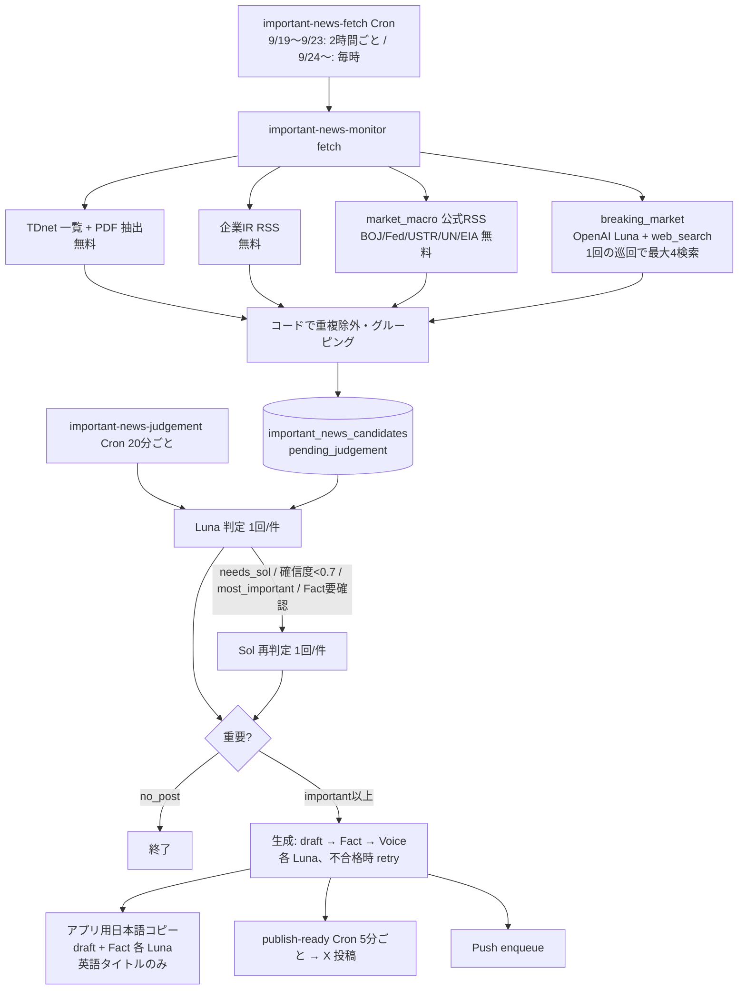

# 重要ニュース監視 コスト最適化 — 調査と計画

- 作成: 2026-09-19（ユーザー直接依頼、G1/G2 とは別枠）
- 調査方法: `origin/main` のソース読解 ＋ 本番 DB の read-only 集計（直近48時間 = 2026-09-17 15時〜09-19 15時 JST 前後）
- 本番変更: なし（この文書の作成時点）

---

## 0. 結論

1. **費用の大半は breaking_market の Web 検索で、しかも DB に記録されていない。** 48時間で検索枠516・実 web_search 366回に対し、有効候補は5件（検索の99%が空振り）。推定 **$4〜7 / 48h**（1回あたり約 $0.011〜0.02）で、DB に見える $1.18 の3〜6倍。
2. **9/18 18:00 〜 9/19 08:00台（JST）の約15時間、OpenAI 呼び出しがすべて HTTP 429 で失敗していた。** 検索180枠が連続で 429。残高切れ（insufficient quota）の形で、9/19 10:00 以降は回復している。この間はニュース以外の AI 機能（X 朝刊・アプリ朝刊など）も失敗していた可能性が高い。
3. **AI 判定費用の約9割は Sol 昇格。** Luna 単体は1件あたり約 $0.0007、Sol を経由すると約 $0.017〜0.023。48時間の判定費用 $1.08 のうち Sol 経由の54件で約 $0.98。そのうち17件は Sol を使っても needs_review / 投稿不可で終わっている。
4. **TDnet の事前除外で減る額は小さい。** Luna で no_post になった TDnet 146件の合計は約 $0.10 / 48h。除外の主な効果は Sol 昇格の対象を減らすことにある。
5. **生成（本文・Fact・Voice）は少額だが、Fact 不合格が多い。** 30日で254件・平均 $0.0025/件。一方で Fact 不合格が 155件（61%）あり、費用より品質の問題。
6. 削減効果の順位: **① breaking の検索を条件発火型に ≫ ② Sol 昇格の条件見直し ≫ ③ TDnet 事前除外 ≈ ④ 生成の効率化**。
7. 最初にやるべきことは **Phase 0（全呼び出しの費用記録）**。既存の `ai_usage_events` テーブルと `important_news_monitor_runs.diagnostics` 列を使えば **migration 不要**で実装できる。

---

## 1. 現行パイプラインの費用フロー



### 1回あたりの AI 呼び出し

| 段階 | モデル | 回数 | 1回あたり費用（実測/推定） | DB 記録 |
|---|---|---|---|---|
| breaking_market 検索 | Luna + web_search | 巡回ごとに最大4 | 約 $0.011〜0.02（推定） | **なし**（回数のみ `diagnostics`） |
| 判定 Luna | Luna | 新規候補1件につき1 | 約 $0.0004〜0.0007（実測） | `estimated_cost_usd` |
| 判定 Sol | Sol ($4/$20 per 1M) | 昇格時のみ1 | 約 $0.017〜0.023（実測、Luna 分込み） | 合算して `estimated_cost_usd`（Luna/Sol 別の内訳・昇格理由は **なし**） |
| 生成 draft / Fact / Voice | Luna | 各1（retry 時 +1〜2） | 合計 約 $0.0025/件（実測） | 合算して `generation_estimated_cost_usd`（段階別は **なし**） |
| アプリ用コピー draft / Fact | Luna | 各1（英語タイトル＋表示対象のみ） | 不明 | **なし** |

---

## 2. DB に記録されていない費用

1. **breaking_market の web_search**: ツール料金（1回あたり）と検索結果トークン。回数だけ `important_news_monitor_runs.diagnostics.breakingMarket.queries[].webSearchCallCount` にある
2. **アプリ用日本語コピー**: `app_copy_*` 列にモデル名・試行回数はあるが、トークン・費用はない
3. **判定の Luna / Sol の内訳と昇格理由**: 合算値のみ
4. **生成の段階別（draft / Fact / Voice / retry）**: 合算値のみ
5. **ニュース以外（参考、今回の範囲外）**: 48時間で AI Lab `brand_post` 40件、`tip` 12件、`interaction` 8件が `post_execution_logs.api_cost_usd=0` で記録、朝の挨拶の画像生成、X 大引けの失敗時の費用も未記録。**OpenAI の残高の減りにはこれらも含まれる**

---

## 3. Web 検索費用（推定）

- 実測できているのは回数のみ: 48時間で **web_search_call 366回**（検索枠516、うち180は 429 で失敗し課金なしと見なす）
- 1回あたりの推定:
  - ツール料金: $0.01（`x-test-post` の既存計算 `morningApiCostUsd` と同じ前提）
  - 検索結果を含む入力トークン: 同じ設定（Luna・`search_context_size: low`・`max_tool_calls: 1`）の X 朝刊の収集 lane が1回 約12,000〜16,000 tokens → 約 $0.0024〜0.0032
  - 出力: 約 600〜900 tokens → 約 $0.0007〜0.0011
  - **合計 約 $0.013（幅 $0.011〜0.02）**
- 48時間の実額推定: 366回 × $0.013 ≈ **約 $4.8（幅 $4.0〜7.3）**
- 429 が無かった場合（20分巡回を48時間）: 約 562回 ≈ **約 $7.3**
- 巡回頻度別（現行ロジックのまま、1巡回4検索）: 2時間ごと 約 $0.6/日、毎時 約 $1.25/日、20分 約 $3.7/日、**10分 約 $7.5/日**
- **Phase 0 で実トークンを記録すれば推定は実測に置き換わる**（Responses API の応答に `usage` がある）

---

## 4. 直近48時間の内訳

| 項目 | 件数 | 費用 | 記録 |
|---|---|---|---|
| breaking 検索 | 366 web_search（516枠） | 約 $4.8（推定） | なし |
| 判定 Sol 経由 | 54件 | 約 $0.98 | あり（合算） |
| 判定 Luna のみ | 165件 | 約 $0.11 | あり |
| 生成 | 37件 | $0.10 | あり（合算） |
| アプリ用コピー | 1件 | 不明（少額） | なし |
| **ニュース合計** | | **約 $6.0（幅 $5.2〜8.5）** | DB 表示は $1.18 |

breaking 検索のトピック別（48時間）:

| トピック | 枠 | 成功 | web_search | 有効候補 |
|---|---|---|---|---|
| critical_market_events（毎回） | 129 | 84 | 93 | 1 |
| japan_security_emergency（毎回） | 129 | 84 | 88 | 0 |
| disaster_infrastructure（毎回） | 129 | 84 | 91 | 0 |
| ローテーション9トピック（計） | 129 | 84 | 94 | 4（us_market_session 2, japan_market_session 2） |

判定の内訳（48時間、TDnet が大半）:

| source | Sol | 結果 | 件数 | 合計費用 | 平均 |
|---|---|---|---|---|---|
| tdnet | あり | important / passed | 22 | $0.409 | $0.0186 |
| tdnet | あり | most_important / passed | 9 | $0.207 | $0.0230 |
| tdnet | あり | no_post / needs_review | 12 | $0.204 | $0.0170 |
| tdnet | なし | no_post / passed | 146 | $0.099 | $0.0007 |
| tdnet | あり | no_post / passed | 4 | $0.082 | $0.0204 |
| market_macro / breaking | あり | 各種 | 7 | $0.071 | — |
| その他 Luna のみ | なし | 各種 | 19 | $0.008 | — |

生成の結果（30日、254件）: Fact 不合格 155件（61%）、Fact 合格・Voice 合格 79件、Fact 合格・Voice 不合格 19件、Voice の再修正が実行されたのは3件。

---

## 5. 削減効果の大きい順の改善案

| 順位 | 改善 | 48h 削減見込み | 精度リスク | Phase |
|---|---|---|---|---|
| 1 | breaking 検索を条件発火型にし、何も起きていない時は0回を許容 | $3.5〜6（検索の70〜90%減） | 取り逃し（公式ソース・イベント窓・トリガーで補う） | 1 |
| 2 | 固定3トピックを公式一次ソース（J-Alert/防衛省、気象庁、公式RSS）へ置き換え | 1 に含まれる | 公式フィードの遅延 | 1 |
| 3 | Sol 昇格を「情報は十分だが判断が複雑」に限定。情報不足は Sol ではなく needs_review | $0.3〜0.6 | 重要案件の見落とし（most_important は維持が安全） | 3 |
| 4 | TDnet の明らかな定型開示を AI 前に除外 | 約 $0.05〜0.10 ＋ Sol 分 | 重要 IR の除外（保守的なルールで回避） | 2 |
| 5 | Fact の数値・日付・コードをコード照合し、AI Fact を因果・意味に集中 | 少額（Fact 不合格 61% の品質改善が主目的） | 低 | 4 |
| 6 | 共通 news_packet（X・アプリ・Push が同じ1回の生成を使う） | アプリ用コピー分 | 設計が大きい | 5 |

---

## 6. Phase 0〜5 の実装計画

### Phase 0 — 全呼び出しの費用記録（本文書の後、すぐ着手可能）

- **DB 変更なし**。既存を流用:
  - `public.ai_usage_events`（feature / model / input_tokens / output_tokens / web_search_calls / cost_usd / related_table / related_id / created_at。feature に制約なし、service_role に INSERT 権限あり、`(feature, created_at)` index あり。現状は MIC の10行のみ）
  - `public.important_news_monitor_runs.diagnostics`（jsonb、既存）に巡回ごとの費用まとめを追加
- 記録する feature 名:
  - `news_breaking_search`（related: `important_news_monitor_runs` / run id）
  - `news_judgement_luna`、`news_judgement_sol|<昇格理由>`（related: candidate id）
  - `news_generation_draft` / `_fact` / `_fact_retry` / `_voice` / `_voice_retry`（related: candidate id）
  - `news_app_copy_draft` / `news_app_copy_fact`（related: candidate id）
- breaking の応答から `usage.input_tokens` / `output_tokens` を取得し、`diagnostics` にも保存（`webSearchCallCount` は既存）
- 単価は定数1か所（Luna $0.2/$1.2、Sol $4/$20、web_search $0.01/回）。請求実績と照合して後から修正できるよう、行にはトークンと回数を必ず残す
- 記録は**ベストエフォート**（失敗しても判定・生成・投稿は止めない）
- 日次集計は SQL（View は作らない。必要になれば後で migration）
- 変更ファイル: `important-news-monitor/` の `breaking_market_source_fetchers.ts`（usage 取得）、`news_collection_diagnostics.ts`（費用まとめ）、新規 `usage_ledger.ts`（単価・集計・書き込み）、`index.ts`（runner / requester を包んで記録）＋テスト
- 本番反映: `important-news-monitor` の deploy が必要（**要承認**）

### Phase 1 — breaking_market の条件発火化

- 固定3トピックを毎回検索するのをやめ、次のいずれかの時だけ検索:
  1. **イベント窓**: FOMC・日銀会合・CPI・雇用統計などの前後（日程表は market_holidays と同様にテーブル化、または既存の経済指標情報を流用）
  2. **トリガー**: 公式ソース（market_macro RSS、TDnet、将来の気象庁・J-Alert）で重大候補を検知した時の補完検索
  3. **最低頻度の見回り**: 公式ソースで拾えない分野（戦争・関税・制裁・海峡・銀行破綻）を、例えば2〜3時間に1回ローテーション
  4. **空振りバックオフ**: 同じトピックが連続で0件なら間隔を延ばす（上限あり）
- 地震・津波・J-Alert は気象庁・内閣官房の公式フィードを優先（Web 検索を置き換え）
- 見込み: 通常日の検索 70〜90% 減。10分巡回にしても検索回数は巡回頻度に比例しない
- **重大速報の取り逃し対策**: 導入前に、過去の有効候補5件と過去の重大事例（9/12 北朝鮮ミサイル、9/13 ホルムズ、9/14 フーシ派）が新方式でも拾えるかを検証

### Phase 2 — TDnet 事前除外

- 「AI 不要と断定できるもの」だけを除外（除外リスト方式、既定は AI に送る）
- 除外候補: 定型人事、定時株主総会の招集・決議、定款変更、コーポレートガバナンス報告書、軽微な組織変更、月次定型、自己株式取得の進捗（取得枠の新設は除外しない）
- 必ず AI に送る: 業績修正、赤字転落・黒字転換、増減配、自社株買いの決定、TOB、M&A、増資、株式分割、上場廃止、大型受注・失注、行政処分、不祥事
- 過去30日の TDnet 判定結果でルールを検証（除外対象に important 以上が1件でもあればルールを外す）

### Phase 3 — Sol 昇格の見直し

- Phase 0 で昇格理由を記録し、理由別の Sol 結果を1〜2週間集計してから判断
- 方針案: `FACT_NEEDS_REVIEW`（情報不足）は Sol に回さず needs_review で停止。`MOST_IMPORTANT_CANDIDATE` と「情報は十分だが判断が複雑」は Sol を維持

### Phase 4 — Fact / Voice の効率化

- 数値・日付・金額・割合・企業名・証券コード・増減方向はコード照合（既存 `localFactIssues` を拡張）、AI Fact は因果・意味・条件欠落・誇張に集中
- Voice は Phase 0 の段階別記録で「実際に修正が必要になった割合」を測ってから判断

### Phase 5 — 共通 news_packet

- market-report と同じ考え方で、1件のニュースにつき headline / summary / detail / key_points / affected_entities / importance / evidence / fact_status を1回生成し、X・アプリ・Push が同じ packet を使う。設計は Phase 1〜4 の後

---

## 7. 変更対象

| Phase | ファイル | DB object | Cron |
|---|---|---|---|
| 0 | `important-news-monitor/{breaking_market_source_fetchers,news_collection_diagnostics,index}.ts`、新規 `usage_ledger.ts` | なし（既存 `ai_usage_events`・`important_news_monitor_runs.diagnostics`） | なし |
| 1 | `breaking_market_source_fetchers.ts`、新規の公式フィード取得、トリガー判定 | イベント日程を置くなら新テーブル（要 migration） | 変更なし想定 |
| 2 | 新規 `tdnet_prefilter_logic.ts`、`index.ts`（判定対象の選別） | なし（除外理由は既存列 `judgement_reason` など） | なし |
| 3 | `importance_judgement_logic.ts` | なし | なし |
| 4 | `post_generation_logic.ts` | なし | なし |
| 5 | 新規設計 | 新テーブル | 未定 |

---

## 8. 他 workstream との競合

- G1（Claude slot 1）: market-report 系。9/24 の自然 shadow 待ち。**触らない**（`market-report-*`、`_shared/market_report_packet.ts`）
- G2（Claude slot 2）: social mobile / 自動投稿アプリ。**触らない**
- H1（Codex slot 1）: `important-news-hourly-cadence-simplify-20260919` は done（`important-news-fetch` Cron の実行時刻ゲートのみ変更、C1 確認待ち）。**Cron は今回変更しない**ので競合なし。ただし `important-news-monitor` の deploy 時は H1 側に未 deploy の変更がないことを確認する
- H2（Codex slot 2）: social mobile。競合なし
- 本作業は `.agent/tasks/*` を変更しない。成果はこの文書と `important-news-monitor/` のソースのみ

---

## 9. 日次集計 SQL（Phase 0 反映後に使用）

```sql
select date_trunc('day', created_at at time zone 'Asia/Tokyo') as jst_day,
  split_part(feature, '|', 1) as feature,
  count(*) as calls,
  sum(input_tokens) as input_tokens,
  sum(output_tokens) as output_tokens,
  sum(web_search_calls) as web_search_calls,
  round(sum(cost_usd), 4) as cost_usd
from public.ai_usage_events
where feature like 'news_%'
group by 1, 2
order by 1 desc, cost_usd desc;
```
